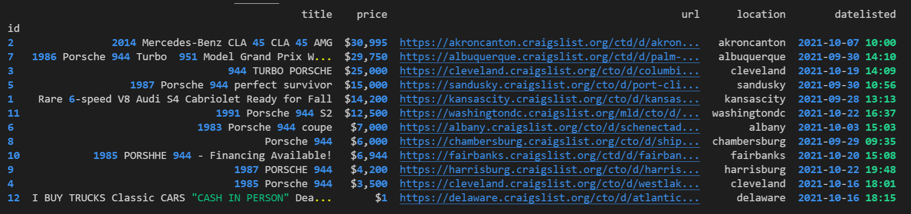

# PorscheFinder


This repo was created to find a Porsche 944 (Praying for a Turbo)! This car means a lot to me. My goal is to use python to find one that is in great shape and also has a good price!

## Python Virtual Environment

When executing python code or installing python applications you should get into the practice of creating and managing python virtual environments.
This will allow you to run different versions of a python library while avoiding version conflicts. My preferred tool for python virtual environments is `venv`
There are tools out there. Remember to find what works best for you.

**On Linux or Mac**

```python
python3 -m venv venv
source venv/bin/activate
```

**On Windows**

```cmd
python3 -m venv venv
.\venv\Scripts\activate.bat
```

## Install project requirements

Once you have your virtual environment setup install the python libraries that are required for this repo.

```bash
pip install -r requirements.txt
```

## Example: Script in action

Now that you have everything installed and updated you can execute the script.

```bash
python main.py
```

Sample output.



>NOTE: Some output has been omitted.


### About me

Introverted Network Automation Engineer that is changing lives as a Developer Advocate for Cisco DevNet. Pythons scripts are delicious. Especially at 2am on a Saturday night.

My hangouts:

- [LinkedIn](https://www.linkedin.com/in/duanlightfoot/)

- [Twitter](https://twitter.com/labeveryday)